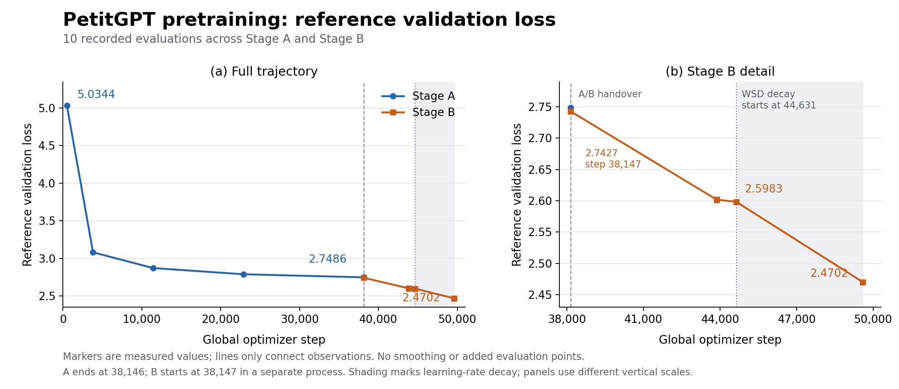
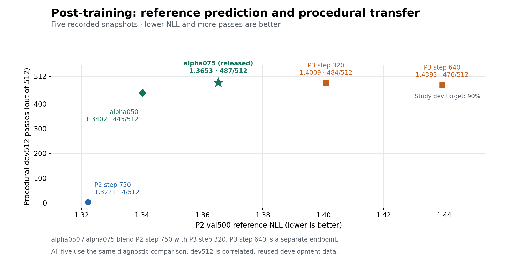
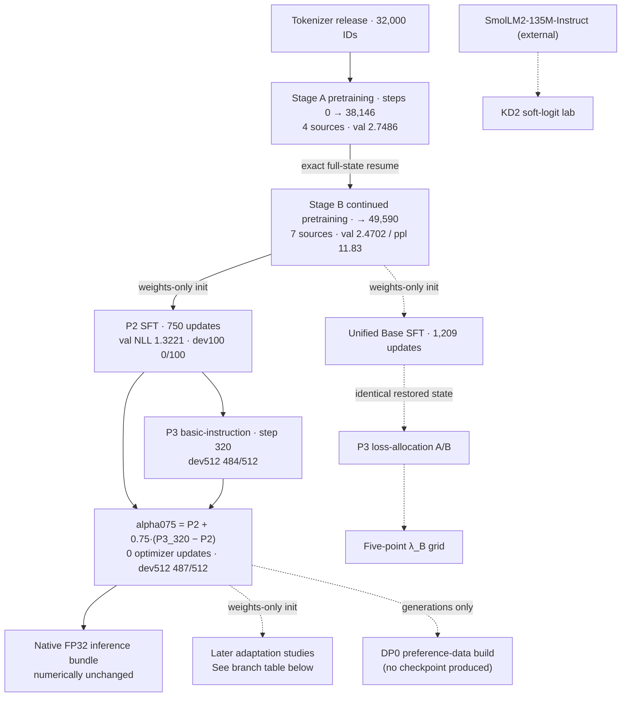

# PetitGPT: Building and Evaluating a 124.6M-Parameter Language Model

Yang Qi — PetitGPT research v1. Code/model/tokenizer: Apache-2.0 for author-controlled rights; author-written documentation: CC BY 4.0. See [documentation licence](DOCUMENTATION_LICENSE.md) and [source notice](SOURCE_NOTICE.md).

## 1. Summary

PetitGPT is a **124.6M-parameter** language model pretrained on **13.0B token positions using one RTX 4090**. A 32,000-token tokenizer, two-stage pretraining, instruction fine-tuning and fixed weight interpolation produced the released **alpha075** model. Pretraining reached reference validation loss **2.4702** (perplexity 11.83); the native export preserves the source weights exactly (`C-ARCH-03`, `C-PT-03`, `C-PT-07`, `C-PT-09`, `C-EXP-01`).

Under the project's zero-shot likelihood protocols, alpha075 scores **57.74% ARC-Easy**, **28.16% ARC-Challenge**, **63.49% PIQA** and **31.28% HellaSwag** accuracy. It leads the two evaluated SmolLM 135M instruct baselines on both ARC tasks and trails them on PIQA and HellaSwag. On IFEval it reaches **17.19% prompt-level strict accuracy**, between SmolLM and SmolLM2 (§8). All comparator scores were measured in this project (`C-BENCH-01`, `C-BENCH-07`, `C-IFEVAL-01`).

**Reliable generation remains the unresolved problem.** Procedural instruction following improved, but later adaptation repeatedly traded natural-task retention for narrow gains. In the versioned full-answer review, alpha075 produced a correct Python interface on **42/46** prompts and a correct whole answer on **0/46**. The strongest outcome is a working, traceable training and export pipeline; lower loss and competitive multiple-choice scores did not establish a reliable assistant (`C-ASSIST-07`).

Read [pretraining](#4-pretraining) for the data and loss curve, [post-training](#5-post-training-and-the-selected-weights) for the selection trade-off, and [evaluation](#8-evaluation) for protocols and results. [Success and failure cases](#85-qualitative-cases-successes-and-failures) illustrate what the scores mean. The [training manual](../../TRAINING_AND_REPRODUCIBILITY.md) describes the public reproduction workflow.

---

## 2. Scope and terminology

This report combines recorded training runs, later research branches, and separate evaluation campaigns. Numbers carry claim identifiers such as `C-PT-03`, resolved through the [public evidence index](provenance/PUBLIC_EVIDENCE_INDEX.json). Aggregate tables, plotting data and seven selected [assistant-response cases](examples/README.md) accompany the report. The raw training corpus, complete evaluation suites and full internal evidence collection are not distributed here.

Four boundaries hold throughout:

- **Two histories stay apart.** §6 separates the parameter ancestry of the selected weights from later branches. Branch updates are never added to the selected model's cumulative exposure.
- **Planned, retained and consumed quantities are distinct.** §4.2 reconciles the token counts exactly.
- **Evaluation records retain their versions.** P3-era diagnostics (§5), historical research scores (§7), public likelihood campaigns (§8.1), two assistant-review versions (§8.2) and IFEval (§8.4) are identified separately. Later reviews do not retroactively change training gates.
- **Comparisons are descriptive and tied to their protocols.** Models differ in training data, compute, tokenizer and architecture. No significance test was run. Reused development sets and benchmark results without a contamination audit do not establish performance on an untouched test set.

### Terms used below

| Term | Meaning in this report |
|---|---|
| NLL / cross-entropy loss | Average negative log-probability assigned to reference tokens; lower is better. It measures reference prediction, not whether a generated answer is correct. |
| SFT / DPO / KD / LoRA | Supervised fine-tuning / direct preference optimization / knowledge distillation / low-rank trainable adapters. The experiment table in §6 distinguishes their actual uses. |
| dev100 | A reused 100-prompt suite scored with narrow, strict generation checks. |
| dev512 | A procedural development battery: exact copying (COPY), field lookup (FIELD), set membership (MEMBERSHIP) and structured output (JSON). Its 32 shared content groups × 4 families × 4 presentations produce 512 correlated rows. |
| val500 | The original P2 validation conversations: 500 rows and 43,573 supervised assistant/EOS targets, also reused for P3 and interpolation diagnostics. |
| old93 | Older generation suite: QA41 + practical38 + Python14, totaling 93 prompts. |
| new96 | Newer generation suite: natural64 + Python32, totaling 96 prompts. |
| Practical group score | Average correctness within each dialogue, then equal weighting of 27 dialogue groups covering 38 turns. Bounds retain unresolved labels; they are not confidence intervals. |
| Joint success | Content success and, where the prompt requires an explicit format, format success. Unresolved judgments remain unresolved. |
| Retention screen / gate | A predeclared threshold for preserving earlier capabilities during adaptation. A failed gate can stop a run or rule out promotion. |
| Envelope / historical screen | Two predeclared multi-metric criteria used by the later A/B interpolation study; results refer only to the five coefficients tested (§7.5). |

---

## 3. Model and tokenizer

### 3.1 Architecture

A pre-norm decoder-only Transformer in the deep-and-thin style: 30 blocks, model width 576, RMSNorm with epsilon 1e-6, a fused QKV projection producing 9 query heads and 3 key/value heads at head dimension 64, rotary position embeddings with theta 10000 over the full head, and a SwiGLU feed-forward block of width 1536 (about 2.67× the model width) (`C-ARCH-01`, `C-ARCH-02`). Dropout is zero, and input/output embeddings are tied, so the 18,432,000-parameter embedding matrix is counted once.

The parameter count is derived rather than rounded: applying the bias-free grouped-query formula to the recorded shape yields exactly **124,635,456**, matching the count recorded independently by the training contract, the export provenance and the export review (`C-ARCH-03`).

The earlier planning-era configuration mentioned in the repository's historical narrative — 16 layers, width 768, multi-head attention, 133,128,960 parameters — is not the shape of this artifact and is never substituted for it (`C-SCOPE-01`).

### 3.2 Tokenizer

A byte-level BPE model with exactly 32,000 IDs, decomposing as 7 registered special tokens + 256 byte-level alphabet symbols + 31,737 merges (`C-TOK-01`). Special IDs are fixed by contract: `[PAD]=0`, `[UNK]=1`, `[BOS]=2`, `[EOS]=3`, `<|system|>=4`, `<|user|>=5`, `<|assistant|>=6`. There is no normalizer, no automatic BOS/EOS post-processor, and no prefix space. Special tokens are inserted by ID and never parsed from text, so a literal `[EOS]` spelling inside user content encodes as ordinary text.

Training consumed 2,511,569 documents and 10,000,043,658 UTF-8 bytes across five buckets, producing 2,323,110,079 tokens at 4.3046 bytes per token (`C-TOK-02`). A streaming validation over every one of those documents recorded **0 round-trip failures, 0 unexpected `[UNK]` occurrences and 0 special-token IDs anywhere**, plus 32 difficult fixtures with no failures and injection hardening intact (`C-TOK-03`). The project's own closeout is explicit that 4.3046 bytes/token is a measurement on the tokenizer corpus and not a budget for the pretraining selection (`C-TOK-04`).

### 3.3 Chat interface

Chat encoding is token-level, not string-templated, and lives in one module. The serialized form is `[BOS] <|system|> system <|user|> user <|assistant|> assistant [EOS] …`, with the system segment omitted when absent. BOS occurs once; EOS closes completed assistant turns. The conversation state machine is strict, and malformed role order, empty content, unsupported roles, extra message fields and context overflow are rejected rather than repaired (`C-EXP-07`).

---

## 4. Pretraining

### 4.1 Data and the actual training mixture

Pretraining consumed two disjoint immutable releases built with the frozen tokenizer. Each document is packed as `[BOS] content [EOS]` with an empty textual separator, so boundary tokens are exactly two per document; across both stages 27,511,462 boundary tokens over 13,755,731 documents confirms that identity (`C-PT-04`). Storage is `uint16`, the contract is canonical, source exhaustion is fail-fast, and replay-on-exhaustion is disabled (`C-DATA-03`).

The selection record establishes the training mixture per source and stage: **Stage A drew on four sources; three further sources appear only in Stage B.** The seven-family reference validation set has different weights and should not be read as the training mixture (`C-MIX-01`).

**Stage A — 10,000,003,234 selected serialized tokens over 9,989,324 documents:**

| Source | Upstream dataset @ revision | Selected tokens | Share | Documents |
|---|---|---:|---:|---:|
| FineWeb-Edu (dedup) | `HuggingFaceTB/smollm-corpus` @ `3ba9d605…` (`fineweb-edu-dedup`) | 7,110,526,955 | 71.11% | 7,350,945 |
| DCLM-Edu | `HuggingFaceTB/dclm-edu` @ `dbad8ad7…` | 2,031,579,037 | 20.32% | 1,593,857 |
| Wikipedia (FineWiki EN) | `HuggingFaceFW/finewiki` @ `8bd13e72…` (`en`) | 507,896,470 | 5.08% | 557,285 |
| Python-Edu | `common-pile/stackv2_edu_filtered` @ `c354dbe8…` | 350,000,772 | 3.50% | 487,237 |

**Stage B — 3,000,004,240 selected serialized tokens over 3,766,407 documents:**

| Source | Upstream dataset @ revision | Selected tokens | Share | Documents |
|---|---|---:|---:|---:|
| FineWeb-Edu (dedup) | `HuggingFaceTB/smollm-corpus` @ `3ba9d605…` | 1,203,125,470 | 40.10% | 1,199,264 |
| DCLM-Edu | `HuggingFaceTB/dclm-edu` @ `dbad8ad7…` | 687,500,443 | 22.92% | 538,590 |
| structured_tutorial | `HuggingFaceTB/smollm-corpus` (`cosmopedia-v2`) + `HuggingFaceFW/finephrase` (`tutorial`) | 343,750,175 | 11.46% | 530,450 |
| Python-Edu | `common-pile/stackv2_edu_filtered` @ `c354dbe8…` | 250,000,383 | 8.33% | 347,145 |
| Wikipedia (FineWiki EN) | `HuggingFaceFW/finewiki` @ `8bd13e72…` | 171,877,052 | 5.73% | 189,465 |
| PES2O | `allenai/dolmino-mix-1124` @ `a319f19e…` (`pes2o`) | 171,875,364 | 5.73% | 625,468 |
| StackExchange | `allenai/dolmino-mix-1124` @ `a319f19e…` (`stackexchange`) | 171,875,353 | 5.73% | 336,025 |

Machine-readable form, including per-source targets, overshoot and the licence string recorded at each pinned revision: [`tables/PRETRAIN_SOURCE_MIXTURE.csv`](tables/PRETRAIN_SOURCE_MIXTURE.csv).

**Recorded source and transport revisions.** PES2O and StackExchange record `source.revision=a319f19e…` and `source.parquet_revision=c58ab4b6…`. The [mixture table](tables/PRETRAIN_SOURCE_MIXTURE.csv) preserves both full revisions, with missing transport fields left unrecorded. Equivalence between the two commits has not been established.

Two qualifications matter. First, these are **selected/retained** counts — the quantity the selection stage committed per source. Packing concatenates documents into a continuous 2,048-token block stream, so a per-source *consumed* figure does not exist as a separate measured quantity; §4.2 gives consumption at stream level only. Second, the `structured_tutorial` node draws on two upstream bindings and the record does not split its 343,750,175 tokens between them.

A single reference-reserve exclusion manifest of 172,483 cleaned-text hashes was carried through the pipeline: supplied to tokenizer training, where 0 samples matched, and enforced at selection for both training releases (`C-DATA-02`). The reference validation set itself draws whole documents from all seven families at a 2,000,000-token quota each, totalling 23,035 documents and 14,003,201 serialized tokens (`C-DATA-01`).

### 4.2 Four token quantities, reconciled

The table reconciles four measured token quantities alongside the original planning target. Differences between the measured quantities are recorded, rather than rounding errors (`C-PT-03`):

| Boundary | Stage A | Stage B | Total |
|---|---:|---:|---:|
| Planned target tokens | 10,000,000,000 | 3,000,000,000 | 13,000,000,000 |
| Serialized tokens (content + BOS + EOS) | 10,000,003,234 | 3,000,004,240 | 13,000,007,474 |
| Retained packed shard tokens (`uint16`) | 10,000,003,073 | 3,000,002,561 | 13,000,005,634 |
| Full model-input block positions | — | — | 13,000,005,632 |
| **Positions the optimizer actually stepped over** | **9,999,745,024** | **2,999,975,936** | **12,999,720,960** |

The three steps between them are each accounted for (`C-PT-11`):

- serialized → retained packed: **1,840 tail tokens** recorded by packer accounting;
- retained packed → full model-input block positions: **2 lookahead positions**, one per stage;
- full block positions → actually consumed: **139 × 2,048 = 284,672** positions in blocks left unconsumed by accumulation alignment (126 in Stage A, 13 in Stage B).

So the retained-minus-consumed difference of **284,674** is not purely batch alignment: it is 2 lookahead positions plus the 284,672 alignment positions. All four counts are record-derived; no raw shard was rescanned. "No replay" describes the executed token-position traversal — one exposure per block, with a committed sampler cursor (`C-PT-10`) — and is *not* a claim that no duplicate text or fact exists anywhere in the corpus.

### 4.3 Optimization and schedule

Batch geometry was micro-batch 8 × gradient accumulation 16 = **128 sequences per optimizer step** at sequence length 2,048, i.e. 262,144 effective batch tokens (`C-PT-02`).

The optimizer is **Muon** on hidden 2-D weight matrices — Newton–Schulz orthogonalization, 5 iterations, momentum 0.95, Nesterov, with Moonlight-style RMS matching scaling the update by `0.2·sqrt(max(fan_in, fan_out))` — plus an auxiliary AdamW (betas 0.9/0.95) covering the token embedding, `lm_head`, router gates and every parameter below 2 dimensions. Both halves live in a single optimizer instance. Peak learning rate 6e-4, weight decay 0.1 on matrices and the AdamW decay group and 0.0 on norms and biases, one global gradient clip at 1.0 per step (`C-PT-05`).

The schedule is one absolute warmup–stable–decay timeline spanning both stages: 500 warmup steps, a shared horizon of 49,590, decay from 44,631 to 49,590, minimum learning-rate ratio 0.1, bf16 precision with `torch.compile` realized as one graph with zero graph breaks (`C-PT-06`). Stage A stopped at its planner boundary **without** resetting the learning rate, and Stage B resumed that exact endpoint as a full-state restore verified across 213 model tensors with optimizer, scaler and RNG state equivalence (`C-PT-01`).

### 4.4 Observed results

Stage A ended at step 38,146. Its own run recorded, at that step, reference validation **loss 2.7486005008441414, perplexity 15.620755345740001** (`C-PT-07`). The Stage B invocation separately recorded 2.742657180890175 at step 38,147 — one optimizer step later, from a different process. Both are reported; neither is used as a substitute for the other.

The Stage A validation trajectory, at the run's own evaluation milestones:

| Step | 500 | 3,815 | 11,445 | 22,889 | 38,146 |
|---|---:|---:|---:|---:|---:|
| val loss | 5.0344 | 3.0812 | 2.8719 | 2.7896 | **2.7486** |

Stage B continued to **2.4702483468921344** (perplexity 11.825383284191247) at step 49,590. During the WSD decay interval, validation loss fell by 0.1280, from 2.5983 at step 44,631. This is the observed change over that interval, not an isolated causal effect of the schedule.



*Figure 1. All ten recorded reference-validation evaluations, with no smoothing or added points. Lines connect observations only. The A/B handover is at step 38,146; Stage B's first evaluation is one update later in a separate process. Shading marks the learning-rate decay interval. The right panel enlarges Stage B; its vertical scale differs from the left. [Full-precision data](tables/PRETRAIN_VALIDATION_CURVE.csv), [SVG](figures/pretraining_validation.svg), and [plotting script](figures/plot_report_figures.py) (`C-PT-13`).*

Per-source reference validation, at the Stage A endpoint and at the final step (`C-PT-08`, `C-MIX-02`):

| Reference source | Stage A endpoint (38,146) | Final (49,590) | Improvement | In Stage A mixture? |
|---|---:|---:|---:|:--:|
| structured_tutorial | 2.7011 | 2.0822 | **0.6189** | no |
| StackExchange | 3.0224 | 2.5514 | **0.4710** | no |
| PES2O | 3.1019 | 2.7737 | **0.3282** | no |
| Python-Edu | 1.7138 | 1.4720 | 0.2418 | yes |
| Wikipedia | 2.7447 | 2.6285 | 0.1162 | yes |
| DCLM-Edu | 2.9820 | 2.8799 | 0.1021 | yes |
| FineWeb-Edu | 2.9759 | 2.9042 | 0.0716 | yes |

Every source absent from the Stage A mixture improved more during Stage B than every source present in it (0.328–0.619 against 0.072–0.242). This is a descriptive ordering over seven recorded readouts on one run. These source families enter the recorded mixture in Stage B; that does not establish that their subject matter was absent from Stage A, whose web sources may cover overlapping topics. The ordering is not a controlled experiment and does not identify the effect of data mixture separately from additional training and the learning-rate schedule. It does, however, show why the Stage A mixture had to be established rather than assumed: reading the seven-family validation set as the training mixture would have hidden this structure entirely.

**Throughput and duration.** Over the logged Stage B window the run covered 2,993,684,480 serialized positions in 32,403.5 seconds, an interval average of about **92,388 positions per second** on one RTX 4090 (`C-PT-09`). For Stage A, the logged train rows span 2026-09-01T17:29:56Z to 2026-09-02T23:19:41Z, an elapsed range of 107,384.6 seconds (≈29.8 hours). That is a timestamp span between logged rows, **not** certified uninterrupted GPU time and not a compute-cost figure; the pretraining sequence includes recorded verification and resume activity, and no attempt was made to reconstruct GPU time from throughput (`C-PT-12`).

The pretrained base's own generation behaviour is the starting point rather than a result: on the frozen 100-prompt development suite it recorded 0/100 strict passes with 100/100 generations hitting the length cap.

---

## 5. Post-training and the selected weights

### 5.1 P2 — concise-instruction supervised fine-tuning

P2 initialized from the accepted base checkpoint through a weights-only stage initialization, not a resume, and ran exactly 750 AdamW updates at learning rate 5e-5, matrix weight decay 0.1, warmup 38, micro-batch 2 × gradient accumulation 16, sequence length 2,048, bf16 forward with selected-position FP32 cross-entropy (`C-P2-01`).

The data are 12,000 training and 500 validation conversations with original messages preserved — no truncation, no injected system text. Supervised targets are 997,427 per exposure at two exposures per row, giving 1,994,854 supervised target observations and 24,000 row exposures; validation carries 43,573 targets (`C-P2-02`). The supervised-target mix is 44.99% general QA, 22.00% text transformation, 20.00% instruction constraints, 8.00% basic Python and 5.00% practical chat, drawn from seven instruction subsets (`C-P2-03`).

**Instruction-data origin.** The seven subsets are row-level `source` values within `HuggingFaceTB/smol-smoltalk` at revision `f73fe857d519ff6ac5af2ea67c4d3834da7b8bcc`, config `default`, train split. The recorded P2 selection is linked to that collection by manifest hashes; component provenance and licence status are summarized in §12 (`C-SRC-01`).

**Supervision policy.** The pinned training encoder supervises **every assistant turn's content and trailing EOS**, masking BOS, role tokens, and system/user content (`C-P2-06`). Execution-time preflight records 997,427 supervised tokens out of 2,403,722 encoded tokens across 12,000 conversations, with zero truncations (`C-P2-07`). Later branches' supervision policies are recorded separately in the experiment ledger.

P2's final measurements were validation token NLL **1.3221**, dev100 strict **0/100**, and `quality_acceptance_demonstrated: false` (`C-P2-04`). Loss improved; usability did not.

### 5.2 P3 — basic-instruction adaptation

P3 started from P2 step 750 with a fresh AdamW (cosine, peak 5e-5, weight decay 0.0, training sequence length 512, 640 updates over two passes); the model context remained 2,048 (`C-P3-01`). Its data are 7,168 training rows carrying 44,544 shifted targets plus 3,072 replay rows carrying 216,932 targets (`C-P3-02`).

P3 produced a clear trade-off. The development battery improved from 4/512 under P2 to 484/512 at step 320 and 476/512 at step 640, including held-out templates. On the same P2 val500 set, NLL rose from 1.322110 to **1.400923 at step 320** and **1.439334 at step 640** (`C-P3-04`). The P2 → P3 step-640 diagnostic comparison also recorded ARC-Easy falling 58.46% → 56.36% and PIQA 64.04% → 63.33%, while some faithful rewrites added facts (`C-P3-03`).

These ARC/PIQA numbers belong to the **P3-era diagnostic evaluator**, not the later public FP32 campaign in §8.1. For example, the same alpha075 weights scored 57.66% / 63.66% on ARC-Easy / PIQA in the interpolation diagnostics, versus 57.74% / 63.49% in the public FP32 results. The [versioned diagnostic table](tables/POSTTRAINING_TRADEOFF.csv) preserves the earlier measurements. Numerical equivalence between those evaluation paths is not established; cross-campaign differences should not be interpreted as training gains or losses (`C-INT-03`).

### 5.3 The selected interpolation

The selected weights are not a training step. They are a parameter blend of two P3-era endpoints:

> `theta = theta_P2_step750 + 0.75 · (theta_P3_step320 − theta_P2_step750)`

Parent B is P3 **step 320**, not the step-640 endpoint (`C-INT-01`). The run executed zero optimizer constructions, zero backward passes and zero optimizer updates, and produced two inference-only artifacts at alpha 0.50 and 0.75. Blending was computed in FP32 on CPU tensor by tensor from the original parents, never recursively, with tied embeddings verified equal in both parents and preserved as a single shared object.

Relative to its actual P3 step-320 parent, alpha075 reduced val500 NLL by **0.035613** (1.400923 → 1.365311), while the development score rose from 484/512 to **487/512**. It remained 0.043201 worse in NLL than P2. Alpha 0.50 preserved more of P2's reference likelihood but reached 445/512, below the study's 90% development target; alpha075 cleared that target and became the working reference (`C-INT-03`).

| Weights | val500 NLL ↓ | dev512 passes ↑ | Role |
|---|---:|---:|---|
| P2 step 750 | 1.322110 | 4/512 | First interpolation parent |
| P3 step 320 | 1.400923 | 484/512 | Second interpolation parent |
| P3 step 640 | 1.439334 | 476/512 | Contextual endpoint; not a blend parent |
| alpha050 | 1.340176 | 445/512 | Fixed 0.50 blend |
| alpha075 | 1.365311 | 487/512 | Fixed 0.75 blend; released working reference |



*Figure 2. Five measured snapshots under the same P3/interpolation diagnostic comparison. Leftward means lower reference NLL; upward means more procedural passes. P3 step 640 is shown for context and did not contribute to either blend. The points describe different objectives, not a single quality ranking; dev512 contains correlated, repeatedly inspected items. [Full-precision data](tables/POSTTRAINING_TRADEOFF.csv), [SVG](figures/posttraining_tradeoff.svg) (`C-INT-03`).*

For continuity with the earlier endpoint comparison, alpha075 is also 0.074023 lower in NLL than P3 step 640 (`C-INT-02`). That is a separate reference point. Even relative to step 320, the improvement is not universal: strict dev100 fell from 20/100 to 16/100 (`C-INT-03`).

The historical registry designated alpha075 a **working reference, not a proven best general assistant**; it had not yet made a release decision (`C-REG-01`). The later research release distributes those weights. Serving as the initialization and retention baseline of later experiments does not establish best overall quality.

---

## 6. Selected ancestry versus research branches



Not every later experiment descends from the selected weights, and the dotted edges say which does what. R1, DP1, KD1, RKD1 and RKD2 each loaded the selected weights with a fresh optimizer, as their own run records state. P4 micro-calibration, the P4 QA increment and dose 6 belong to the same line, but their exact initialization checkpoint is not stated in the bound records and is not asserted here. DP0 produced *data* from the selected model's generations and trained nothing. The unified Base SFT curve started from the accepted pretrained Base, not from the selected weights; the loss-allocation A/B split from that curve's step 403; the quarter-point grid interpolated the A/B endpoints. KD2 ran entirely on external SmolLM2 models — the lab isolates method learning and token alignment on a matched-tokenizer pair, and no PetitGPT checkpoint was opened in it.

### Research branch names

The table summarizes initialization and outcome; full settings and score versions are in the [experiment ledger](tables/RESEARCH_EXPERIMENT_LEDGER.csv). None of these branches replaced alpha075 in the release.

| Code | Method / question | Initialization | Recorded outcome |
|---|---|---|---|
| P4 micro / P4 QA / dose6 | Natural-task SFT, a QA increment, and repeated curriculum exposure | alpha075 line; exact checkpoints not stated | Completed; local gains and retention trade-offs, no promotion |
| R1 | One pass over a mixed behaviour curriculum | alpha075 weights | Stopped at retention check after 96/192 planned updates |
| DP0 | Build preference pairs from generated answers | alpha075 generations | Data only; no trained checkpoint |
| DP1 | DPO preference fine-tuning | alpha075 policy and reference | Stopped after 20/40 updates; retention failed |
| KD1 | Chosen-answer cross-entropy control for DP1 | alpha075 weights | 20 updates; retention failed |
| RKD1 | Dense SFT on teacher-authored responses | alpha075 weights | Stopped after 77/154 updates; retention failed |
| RKD2 | Response distillation with rank-16 LoRA | Frozen alpha075 plus adapters | Stopped after one pass; two retention scores below thresholds |
| KD2 | Hard-answer CE versus soft-logit KD | External SmolLM2 models | Method-control experiment; no PetitGPT update |
| Unified Base SFT | Three-pass MAIN + procedural curriculum | Pretrained Base | 1,209 updates; terminal screen failed |
| Loss-allocation A/B | Token mean versus equal procedural-family means | Identical restored Unified Base SFT step 403 | Development gain with practical-score loss |
| Five-point grid | Weight blends of the A/B endpoints | A/B endpoints | None of five evaluated coefficients met either screen |

The selected weights contain no later response-KD, no unified Base-SFT, no DPO, no soft-KD and no LoRA update; the export provenance lists those five exclusions explicitly. Response-distillation data *were* consumed by later branches, which is a statement about downstream data flow, not about the selected weight path. Full parentage with per-branch evidence: [`tables/MODEL_LINEAGE.json`](tables/MODEL_LINEAGE.json).

One naming collision is worth defusing: the `lambda_B` coefficient of the five-point grid interpolates two loss-allocation arms and is unrelated to the `alpha` that produced the selected weights, which appear there only as a read-only off-grid comparator.

---

## 7. Main experiments, organized by question

**Score provenance.** This section reports each experiment's historical labels and stopping rules. The research-snapshot scorecard gives alpha075 QA bounds `[4, 7]/41` and practical bounds `[22/81, 23/81]`; later studies reused those baselines where stated. They differ from the two full-answer review versions in §8.2. Individual run reports remain the source for their own branch scores, as recorded in the ledger's `protocol_version_of_scores` column. Later relabeling does not revise an earlier retention decision (`C-RES-17`).

### 7.1 Did lower loss predict better generation?

**Lower loss did not guarantee better generation in the evaluated settings.** Loss remained informative — it is what the schedule optimized, and it tracked pretraining progress sensibly — but it was not sufficient on its own to predict task reliability.

The natural-curriculum dose-6 run drove its own training rows to NLL **0.0267** while its development score fell to 443/512 and its practical group bounds fell to `[25/162 .. 1/6]` (`C-RES-03`). The unified Base SFT curve shows the same dissociation across a trajectory: training NLL fell monotonically from 2.3323 to 0.7857 over 1,209 updates while held-out NLL reached its *minimum* of 1.6574 at step 403 and rose afterwards to 1.7251; its terminal screen was not passed (`C-RES-04`).

The same pattern appears in preference space. DP1's mean DPO loss fell from about `ln 2 = 0.6931` to **0.2151** on 160 training pairs and to 0.3620 on 29 held-out pairs, with all 189 reference-relative margins positive behind verified gradient, masking and swap tests. On the very prompts it trained on, generation joint success was 3/32; on preference-held-out prompts 2/29 (`C-RES-02`).

On the retention diagnostic, DP1's terminal state **retained 24 of 34 joint passes, with 9 recorded content losses**; one further recorded joint failure concerned a format violation — a banned pronoun — that was already present in the baseline text for the same item, so read symmetrically it is a fail-to-fail rather than a newly lost validated answer. The original scores and the documented one-item sensitivity are kept separate, and neither changes any stop rule (`C-RES-02B`).

### 7.2 Did correcting the answer text instead of the preference help?

**Chosen-answer SFT improved fitting and sampled-answer retention relative to the DPO control, but still failed the retention gate.**

KD1 used the same 160 chosen answers, the same order and learning-rate prefix as DP1's first 20 updates, but plain supervised cross-entropy on the chosen side only. It did what the objective promises — chosen-answer likelihood rose more than DPO's on both splits (training chosen NLL 1.3857 → 1.1471 versus 1.2248; held-out 1.4035 → 1.3030 versus 1.3419) and it recovered more sampled answers, reaching 27/34 positive-only retention against DP1's 24/34. It still failed the historical retention gate, with practical upper bound 19/81 below the fixed 22/81, and produced one natural gain against two losses in a single class (`C-RES-13`).

This was a bounded 160-example, 20-update control. It neither establishes nor refutes sequence-level knowledge distillation in general, and it does not show that 20 updates suffice for the best achievable cross-entropy result.

### 7.3 Did more response-distillation data, or a cheaper adapter, help?

**Neither dense response distillation nor the LoRA run preserved the required capabilities; both stopped at retention checks despite improved fitting.**

RKD1 ran dense response distillation and stopped permanently at update 77 of a planned 154 when the retention screen fired. Fitting improved on both splits (training NLL 2.0104 → 1.8384, held-out 1.8251 → 1.7159) while held-out joint success fell from 25/96 to 20/96 with 4 confirmed gains against 9 losses; the development total was *unchanged* at 487/512, concealing 13 gains and 13 losses (`C-RES-14`).

RKD2 repeated the idea through rank-16 LoRA adapters (4,331,520 trainable parameters across 150 wrapped modules), completing one full pass before a predeclared gate stopped it because both held-out and practical group scores fell below their thresholds. Fitting improved further and the development score rose slightly to 489/512, but held-out fell to 18/96 and the practical group score collapsed to 1/6. Every original parameter was verified unchanged tensor by tensor, and disabling the adapters recovered the base function bit-exactly (`C-RES-15`).

Neither result establishes that LoRA is better or worse than full fine-tuning: the two runs differ in parameterization, schedule *and* exposure at once, so this is an adaptation/retention observation rather than a matched causal comparison.

### 7.4 Was teacher-logit distillation involved at all?

**Teacher-logit distillation was not part of the PetitGPT weight path.** No run in the permitted source set computes or stores teacher logits for PetitGPT, and no KD loss term appears in any recorded PetitGPT objective. What did execute was teacher-authored or revised hard responses — DP0's 198 preference pairs, whose chosen sides are 177 reused source references plus 21 minimal corrections written by the agent conducting that experiment — and a standard DPO pilot. A teacher-authored chosen string is not a distilled model, and DPO is not divergence minimization to a teacher distribution (`C-RES-11`).

The one genuine soft-logit experiment, KD2, ran on external SmolLM2 models sharing a tokenizer verified equal across all 49,152 token strings and IDs, which is what makes a clean method-learning and token-alignment comparison possible. Its numerical contrast worked as designed: cross-entropy fit the hard references more closely while CE + KD moved the student's temperature-2 distributions closer to the teacher. It produced no held-out generation improvement — joint successes were 3/29 → 2/29 → 2/29 on the held-out set and 22/34 → 22/34 → 21/34 on the additional untrained set for initial, CE and KD respectively. No PetitGPT retention gate was applied to it, and none should be.

### 7.5 Could loss re-allocation or weight interpolation buy back the trade-off?

**Loss re-allocation gained development passes at a practical-score cost; none of the five subsequent blends met either selection criterion.**

The matched A/B isolates the loss-allocation change. Both arms restored the *identical* saved step-403 model, AdamW moments, per-parameter counters, exposure ledger and RNG state, then ran 403 further updates differing only in how within-family loss was allocated, preserving both the main coefficient and the total family mass. Arm B gained 10 membership development passes (67 → 77) and 11 development points overall, but the gain is a polarity trade: development true positives rose 29 → 46 while true negatives fell 38 → 31. The *training* signal did not improve — membership training NLL rose from 0.2932 to 0.2982 and the training two-label argmax count fell from 20/32 to 19/32 — and the practical group score fell from 5/18 to 13/54. The frozen descriptive outcome is a development-only gain with mixed mechanism evidence, and the balanced-tradeoff signal is false (`C-RES-05`). The development gain therefore does **not** establish better training uptake.

Interpolating between those arms was measured at five fixed coefficients. Development totals run 418, 420, 426, 430, 429 at `lambda_B` 0, 1/4, 1/2, 3/4, 1, and membership runs 67, 69, 75, 76, 77. From arm A to the 3/4 point the +12 total decomposes as COPY +1, FIELD +3, JSON −1, MEMBERSHIP +9 — membership dominates but is not the only family that moves. Neither frozen screen passed at either new point (`C-RES-06`). Each quarter point also reproduced its nearer parent's exact output text on the large majority of items, which is a decoding observation about this segment, not evidence of an internal parent-selection mechanism.

Two limits constrain this comparison. Five observed coefficients cannot show that a criterion is unreachable across a continuous segment; the supported statement is that **none of the five evaluated points met the envelope or the historical screen** (`C-RES-07`). And the selected model's recorded practical bounds `[22/81, 23/81] = [44/162, 46/162]` **overlap** arm A's `5/18 = 45/162`, so it is not established to beat arm A on that axis; its QA interval `[4, 7]/41` likewise overlaps every grid score of 6 or 7 (`C-RES-08`).

### 7.6 A measurement caveat that survives every comparison

**Reference-token likelihood, generation accuracy and gradient contribution are different measurements.**

`exp(−mean NLL)` is a teacher-forced geometric-mean probability of the reference token, not accuracy: at the unified 1,209-update snapshot the membership value is 0.5782 while greedy training accuracy is 20/32 = 0.625 and greedy development accuracy is 70/128 = 0.5469 (`C-RES-09`). Likewise token share, scalar loss share and gradient share are three different things: the P3 target share is 0.1088 while the P3 cumulative raw NLL share is 0.0075, and neither measures gradient contribution (`C-RES-10`).

---

## 8. Evaluation

### 8.1 Public multiple-choice likelihood (frozen, FP32)

The four tasks were measured in two campaigns: **FP32 V2** for ARC-Easy and PIQA, followed by **benchmark extension V1** for ARC-Challenge and HellaSwag. The table keeps their task results separate; there is no combined benchmark score.

The [archived evaluation source](../../recipes/research-v1/sources/benchmark_extension/README.md) links the actual programs for both likelihood campaigns and final IFEval completion V2, with source hashes and execution prerequisites. The source publication does not include the complete runtime data and evidence needed for replay.

| Model | ARC-Easy | ARC-Challenge | PIQA | HellaSwag |
|---|---:|---:|---:|---:|
| **PetitGPT alpha075** | **57.74 / 52.36** | **28.16 / 32.68** | **63.49 / 62.30** | **31.28 / 35.60** |
| SmolLM-135M-Instruct | 49.24 / 43.48 | 25.43 / 27.22 | 67.08 / 67.25 | 34.60 / 41.96 |
| SmolLM2-135M-Instruct | 54.00 / 48.82 | 25.94 / 27.73 | 66.70 / 66.76 | 35.02 / 42.90 |

Each cell is **acc / acc_norm, in percent**. Full-precision values, integer correct counts, dataset revisions and result versions are in [PUBLIC_BENCHMARK_RESULTS.csv](tables/PUBLIC_BENCHMARK_RESULTS.csv). The original six ARC-Easy/PIQA records are preserved unchanged (`C-BENCH-01`, `C-BENCH-02`, `C-BENCH-07`).

| Task | Official split | Documents per model | Result collection |
|---|---|---:|---|
| ARC-Easy | test | 2,376 | FP32 V2 |
| PIQA | validation | 1,838 | FP32 V2 |
| ARC-Challenge | test | 1,172 | Benchmark extension V1 |
| HellaSwag | validation | 10,042 | Benchmark extension V1 |

**Prompts and scoring.** These are zero-shot candidate-likelihood evaluations, with each model's own tokenizer and `add_special_tokens=False`. ARC and PIQA use `Question: <unchanged question or goal>\nAnswer:` and a continuation of one ASCII space plus the official answer text. HellaSwag uses the pinned task's `process_docs` query and preprocessed endings. No chat template, role tokens, few-shot examples, inserted BOS, scored EOS or text generation is used. `acc` selects the first maximum of summed continuation log-likelihood; `acc_norm` divides that sum by the candidate's Unicode character count, excluding the leading delimiter. This is the original choice text for ARC/PIQA and the task-preprocessed ending for HellaSwag (`C-BENCH-03`, `C-BENCH-08`).

**Numerical protocol.** Both campaigns use FP32 parameters, forward computation, log-softmax and likelihood sums; autocast and TF32 are disabled. Attention uses PyTorch's **MATH scaled dot-product attention (SDPA)** backend. Batch size is 1 without padding, KV cache or compilation. The evaluator is a native implementation following **lm-evaluation-harness**, pinned at commit `b954108c9baaaa934b4ad842033b31a97ee30816`; a full installed-harness run is not claimed. Dataset and model revisions and task-specific settings are in [EVALUATION_PROTOCOLS.json](provenance/EVALUATION_PROTOCOLS.json) and the result CSV (`C-BENCH-04`, `C-BENCH-08`).

Original-campaign accounting is retained in the [protocol metadata](provenance/EVALUATION_PROTOCOLS.json) (`C-BENCH-05`). Section 9.4 explains the parity failure in the earlier attempt and the numerical correction used for the reported results (`C-BENCH-06`).

ARC-Easy and PIQA were reused during development. The later extension does not establish that ARC-Challenge or HellaSwag were absent from training data; no contamination audit was performed. These are descriptive comparisons between differently trained models, and candidate selection accuracy does not establish free-generation reliability.

### 8.2 Historical full-answer assistant review

The second evaluation family is a full-answer review of generated text across 189 prompts per model — 93 from the older suite and 96 from the newer — over three models, giving 567 answers and 565 distinct prompt/output/contract units (`C-ASSIST-01`).

Two named versions exist and must never be merged: `assistant_review_fable_v1`, the reviewing model's original 567 final records, and `assistant_owner_clarification_4_v1`, which applies four explicit final-content decisions while preserving every other axis and every source data field. Exactly 18 of 284 leaf fields differ between them, and the practical group bounds are identical in both (`C-ASSIST-02`). The four amendments change two comparator content judgments to false, one selected-model item to unknown, and one selected-model item to true; derived unresolved content records rise from 7 to 8 (`C-ASSIST-05`).

**Selected model under `assistant_owner_clarification_4_v1`** (true / false / unknown out of n):

| Slice | Axis | True | False | Unknown | n |
|---|---|---:|---:|---:|---:|
| old_qa41 | content, joint | 6 | 33 | 2 | 41 |
| old_practical38 | content, joint | 10 | 26 | 2 | 38 |
| old_practical38 | explicit format | 20 | 1 | 0 | 21 |
| old_python14 | content, joint | 0 | 14 | 0 | 14 |
| old_python14 | interface | 11 | 3 | 0 | 14 |
| new_natural64 | content, joint | 3 | 61 | 0 | 64 |
| new_python32 | content, joint | 0 | 32 | 0 | 32 |
| new_python32 | interface | 31 | 1 | 0 | 32 |

Full three-model, both-version table: [`tables/ASSISTANT_RESULTS_VERSIONED.csv`](tables/ASSISTANT_RESULTS_VERSIONED.csv) (`C-ASSIST-03`).

The practical figure is a group score, not a row rate. Its denominator is **27 equally weighted dialogue groups over 38 scored turns**: rows are averaged inside each original conversation group first, and only then are groups combined with equal weight. Final bounds are 26/81 .. 10/27 (= 52/162 .. 60/162, i.e. 32.0988% .. 37.0370%) for the selected model, 47/81 .. 17/27 and 8/81 .. 1/9 for the two comparators. These are exact unknown-retention bounds, **not confidence intervals**, and no significance test was run anywhere (`C-ASSIST-04`).

Two entries must be read as recorded rather than as results. The selected model's old-Python finite-execution field is `not_recorded` for all 14 items — unavailable in this imported view, **not** proof that no historical function test ever ran (`C-ASSIST-06`). And results where a legitimate builtin was unavailable in the restricted worker remain unknown rather than model failures.

The Python picture is the sharpest single finding here: across the 46 Python prompts covered, the selected model produced a correct function **interface** in 42 and a correct whole answer in **0** (`C-ASSIST-07`). Here, interface success means the requested function name and calling signature are present. Whole-answer review also checks implementation, required edge cases and explanatory text; **0/46 is not a training-set accuracy or a uniform unit-test pass rate**. Section 8.5 shows concrete examples. These results concern a small, repeatedly reused development set and do not establish that the model can never write correct code.

### 8.3 Review method and development-set reuse

The source report identifies the reviewing model as **Claude Fable 5.1, run through Claude Code at high effort**. This is the recorded model designation; an exact API snapshot identifier is not established here (`C-ASSIST-09`). The review proceeded in three stages. The initial pass over the 565 units was conducted with model metadata masked and with its own recorded limitations; a subsequent pass with the mapping visible produced 17 consistency edits; the four owner clarifications came later still and form a separate, separately named version (`C-ASSIST-08`). So this was neither strict blinding throughout nor all original labels visible throughout. It remains a model-assisted review rather than human adjudication, and no judgment was redone for this document.

Development sets — the 100-prompt suite, the 512-item battery, the older and newer suites, the terminal suite, and the original ARC-Easy/PIQA benchmarks — have been read and re-read across many runs and have not been untouched final tests for a long time. The 512-item battery factorizes as **32 shared content/value groups × 4 task families × 4 presentations = 512**, with 128 distinct family-group pairs at 4 rows each (`C-EVAL-P3`). Neither the 32 nor the 128 is a certified independent sampling unit; the safe reading is simply that these are correlated presentations rather than 512 independent observations.

Score revisions such as the four clarifications are re-interpretations of unchanged historical outputs. They are not parameter improvements and do not retroactively change any earlier training gate.

Runtime also affected the outputs: the same P2 checkpoint, prompts and greedy settings produced **30 differing answers out of 96** between two torch versions, with exactly one label moving (`C-RES-12`). Identical scores would not have meant identical answers.

### 8.4 IFEval instruction following

**IFEval completion V2** is the completed three-model generation evaluation: 541 official prompts per model, containing 834 instructions across 25 instruction types. The pinned `google/IFEval` release exposes its evaluation prompts in a single split named `train`; that dataset label does not mean these prompts were used to train PetitGPT. All prompts were evaluated without dropping or truncating inputs (`C-IFEVAL-01`, `C-IFEVAL-02`).

| Model | Prompt strict | Prompt loose | Instruction strict | Instruction loose | Outputs hitting cap |
|---|---:|---:|---:|---:|---:|
| **PetitGPT alpha075** | **93/541 (17.19%)** | **96/541 (17.74%)** | **238/834 (28.54%)** | **250/834 (29.98%)** | **40/541** |
| SmolLM-135M-Instruct | 56/541 (10.35%) | 65/541 (12.01%) | 182/834 (21.82%) | 201/834 (24.10%) | 290/541 |
| SmolLM2-135M-Instruct | 117/541 (21.63%) | 122/541 (22.55%) | 299/834 (35.85%) | 311/834 (37.29%) | 233/541 |

Prompt accuracy requires all applicable instructions in a prompt to pass; instruction accuracy counts individual instructions. Strict and loose scores use the pinned task's respective **programmatic verifiers**. There is no reviewing language model in this evaluation. Full-precision results and stop counts are in [IFEVAL_RESULTS.csv](tables/IFEVAL_RESULTS.csv) (`C-IFEVAL-01`).

Each unchanged user prompt is encoded with the model's native chat template. SmolLM2's template inserts its default system text; PetitGPT has no default system text. Generation is greedy with a **1,280-new-token cap**, FP32 parameters and forward computation, MATH SDPA, batch size 1 and KV caching enabled. Autocast, TF32 and compilation are disabled; there is no repetition penalty or additional stop string (`C-IFEVAL-02`).

Cap-hit responses were scored as generated. Their frequencies differ substantially across models; these measurements do not predict scores under a larger cap or a different template. The result applies to the [recorded protocol](provenance/EVALUATION_PROTOCOLS.json), and is separate from the historical full-answer review in §8.2.

### 8.5 Qualitative cases: successes and failures

These **seven hand-picked alpha075 answers** illustrate what the historical review measured. Original labels use `assistant_review_fable_v1`, with no rescoring. **One case, `R1DEV-FOLLOWUP-007`, was amended from content/joint false to true in `assistant_owner_clarification_4_v1`; the other six were unchanged** (`C-ASSIST-05`). The cases are not a random sample or an estimate of success rates. Complete prompts, stored answers and original review reasons are in the [case-study companion](examples/README.md), with [machine-readable records](examples/ASSISTANT_CASE_STUDIES.json) (`C-ASSIST-10`).

**Summary and context-update tasks show both complete successes and failures.** Requests below are summarized; the model responses are quoted in full.

| Case | Request (summary) | Complete alpha075 response | Historical outcome |
|---|---|---|---|
| `PRACTICAL_077_M2` | Reduce Emily's email proposing a phonics workshop and hands-on activities to one short sentence. | “Emily proposes a workshop on phonics instruction and suggests hands-on activities and resources.” | **Content and format pass:** retains the proposal and topic in one sentence. |
| `R1DEV-REWRITE-008` | Summarize Victor's request that Uma finish weekday drilling by noon, after work continued until 1:30 pm on Tuesday and Wednesday. | “By 1:30 pm on weekdays, the drilling was completed.” | **Format pass, content fail:** one sentence, but the request and noon deadline are lost. |
| `R1DEV-FOLLOWUP-001` | Update the balance after the fee changes to USD 240 and the deposit remains USD 60. | “The balance on the first evening is $180.” | **Content pass:** correctly uses the amended fee. |
| `R1DEV-FOLLOWUP-007` | Give the new closure interval when lunch now starts at 1:30 pm and still lasts an hour. | “On weekdays, the receptionist says the lunch break now starts at 1:30 pm and still lasts an hour.” | **Judgment changed:** original review fails content/joint for omitting the explicit 1:30–2:30 pm interval; owner clarification passes the same answer. |

The last case illustrates a scoring boundary: the answer gives the new start and duration, from which the end time can be inferred. The original review required the explicit interval; the owner-clarification version accepts the unchanged answer. It is not a failure under the version used in §8.2. Both follow-up cases use an earlier assistant answer supplied as fixed context; they do not demonstrate free-running multi-turn dialogue.

**Python shows useful partial implementation without a complete pass.** The following are exact code excerpts; accompanying prose is retained in the companion.

`PYTHON_041_M1` asks for the **number** of regular-expression matches:

```python
import re


def count_matches_regex(text, pattern):
    matches = re.findall(pattern, text)
    return matches
```

The function name, arguments and matching operation are correct. The return value is a list rather than its length: interface passes, content fails.

`R1DEV-PYTHON-013` asks for the mean, returning the caller's `default` unchanged for an empty list:

```python
def average_or_default(numbers, default):
    return sum(numbers) / len(numbers)
```

The non-empty calculation is correct, but the empty case divides by zero and never uses `default`. The model's accompanying claim, “The `default` value is returned when the list is empty,” contradicts its implementation. This also passes interface and fails content.

For contrast, `PYTHON_035_M1` requires a zero-argument function producing 100 numbered lines. The response defines `generate_string_with_100_lines(lines)` and returns `f"python: {lines}"`. It fails both the calling interface and the requested behaviour; its full repetitive answer is preserved in the companion.

These cases explain the distinction between the 42/46 interface count and the 0/46 whole-answer count. They also show why a one-sentence output or a plausible code block alone is insufficient evidence of task completion.

---

## 9. Reproducibility and export

### 9.1 What the export is

The export re-serializes the selected weights without changing a numerical value. All 213 named source state entries match exactly in dtype, shape and value after strict native loading and safetensors reload; 212 unique tensors are stored with an explicit alias tying the input embedding to the output head, and the reconstructed embedding is one shared parameter and one storage. Sixty non-persistent rotary buffers also match. The recorded total is 487 tensor-equality comparisons (`C-EXP-01`).

The three core modules are byte-identical to the project originals. The only behavioural code change anywhere in the bundle is a single added keyword argument on the generation helper so the FP32 profile can disable autocast; the greedy algorithm and forward logic are unchanged (`C-EXP-03`).

### 9.2 Parity, and what it does and does not show

Parity was measured on exactly eight frozen fixture pairs — four under a `bf16_native` profile and four under `fp32_math`. Every pair matched on prompt IDs, boundaries, full-shape logits, greedy output token IDs and stop reason, with a **maximum absolute logit difference of 0** within each profile (`C-EXP-02`).

This is a numerical parity check **between a source model and its export under the same profile**. It is not a quality test, not a semantic evaluation, and it does not assert that the two profiles agree with each other. Generated answers, including incorrect and truncated ones, were retained without semantic scoring.

### 9.3 Portability, honestly bounded

Export inference ran in one fresh process with a temporary working directory, an empty import path, package imports drawn from the extracted artifact, and an audit hook denying network access and access to the original repository. No denied access occurred, and the archive was independently extracted with all paths, the exact file set, sizes and hashes checked (`C-EXP-05`).

That establishes **local import closure on the measured environment**. It is not a clean-machine test, not a cross-hardware test and not a fresh dependency-installation test. Matching library versions are not evidence of bit-identity on other hardware. The bundle is **native PyTorch CUDA inference only**: there is no implemented or tested Transformers `AutoModel`, GGUF, ONNX, vLLM or llama.cpp path, and a CUDA GPU is required (`C-EXP-06`).

### 9.4 A precision issue that was found and closed

The public benchmark's first attempt failed its likelihood-parity check and was excluded from the reported benchmark results. Its null metrics remain in the historical record. The second attempt amended only the numerical path — FP32 parameters and forward, autocast disabled, TF32 off, MATH SDPA, unpadded batch 1 — before any V2 model output was produced, and its FP32 validation summary records zero failed records per model with maximum per-token errors of 5.7e-06, 7.6e-06 and 1.3e-05. Four deliberately observational BF16 forwards on the already-failing fixture were kept as diagnostics and never gated or retried. The project's reading is appropriately narrow: stable FP32 witnesses are evidence compatible with reduced-precision or numerical-path sensitivity, not proof that a particular kernel is at fault (`C-BENCH-06`).

---

## 10. Findings and failure analysis

### 10.1 Observations

1. **The governed pipeline held.** Frozen plan binding, immutable single-publication releases, exclusion-manifest propagation, deterministic no-replacement sampling with a committed cursor, exact-state stage handoff and a parameter-count audit that fails before training all executed as specified across 49,590 optimizer steps.
2. **Pretraining loss behaved as intended**, falling to 2.4702 with a clean decay tail, and the per-source decomposition separates sensibly by domain.
3. **Provenance is now traceable end to end.** Every pretraining source resolves to an upstream dataset and revision, and each release's document hash matches the selection stage's binding digest for that source.
4. **Instruction adaptation transferred on controlled tasks**, moving the 512-item battery from 4/512 to 484/512 and then 487/512 after interpolation.
5. **Interpolation provided a measured compromise.** Alpha075 reduced reference NLL by 0.035613 relative to its P3 step-320 parent and gained three development passes, while remaining worse than P2 in reference NLL and losing four strict dev100 passes relative to step 320 (§5.3).
6. **Predeclared guards actually fired.** R1, DP1, RKD1 and RKD2 all stopped themselves on retention screens, and no recipe was changed after scores were seen.
7. **Ordinary QA and complete natural-task generation remained limited across the evaluated configurations**, while local successes and different label versions genuinely differ. Individual points, each with its own source and label version: the unified Base SFT terminal records 7/41 on the older QA suite under its own report; R1 step 96 records 6/41 with 1 unknown under the research-snapshot scorecard; the selected model records 6/41 with 2 unknown under `assistant_owner_clarification_4_v1` and 4/41 with 3 unknown under the scorecard row. On the newer natural suite, RKD1 step 77 records 5/64 under its own report, R1 step 96 records 4/64 with 1 unknown, and the selected model records 3/64. These come from different suites, protocols and label versions and are **not** combined into a cross-version maximum (`C-RES-16`).

### 10.2 Hypotheses, labelled as such

Not established; recorded as candidate explanations only. The instruction data may be too small or too narrow relative to what free generation requires, given roughly 2.0M supervised target observations against 13.0B pretraining positions. The persistent interface-correct / body-wrong pattern in Python is *consistent with* surface-form imitation outrunning semantic grounding, but no probe in the record isolates that. The recurring pattern of development gains alongside practical losses is *consistent with* a narrow-task/broad-task trade, but every run showing it changed more than one variable — except the loss-allocation A/B, which found a development-only gain with no matching training-uptake improvement.

### 10.3 Untested alternatives

Longer or differently scheduled instruction training; larger or more diverse instruction corpora; on-policy teacher feedback loops (never run); genuine teacher-logit KD on PetitGPT; multi-seed replication of any comparison; evaluation on a genuinely untouched held-out set. None is claimed here to be promising or unpromising.

### 10.4 Non-inferences

Nothing here supports: that all negative methods are generally ineffective; that 124.6M parameters constitute a capacity ceiling; that the architecture or tokenizer failed; that weight interpolation is universally unhelpful; or that the model lacks useful signal. What the record supports is narrower: *these particular configurations, at this scale, under these protocols, produced these results.*

---

## 11. Limitations and intended use

**Scale and compute.** One RTX 4090, one seed per comparison, 13.0B pretraining positions, and post-training runs measured in tens to low thousands of optimizer updates.

**Judge fallibility.** Semantic labels are model-assisted rather than human adjudication, with the mixed masking chronology described in §8.3. Contradiction lists are non-exhaustive. Unresolved judgments stay in their denominators.

**Finite functional testing.** Python execution used a restricted-builtins worker over fixed case sets. A finite pass proves the supplied cases only; unsupported legitimate builtins remain unknown, never converted into demonstrated failures.

**One-seed comparisons and coupled variables.** Several runs changed data, learning rate, exposure and objective together. Only the loss-allocation A/B isolates a single variable from an identical restored state, and even that inherits optimizer momentum accumulated under the original objective.

**Imperfect source certainty.** Group identifiers do not prove semantic independence; "held-out" in the preference pilot means excluded from that optimization, not historically unseen.

**Intended use.** Research and engineering record only. This is not a safety- or correctness-certified assistant. It has not been evaluated for long-context work, multilingual behaviour, tool use, extended multi-turn dialogue, safety or refusal behaviour, factual currency, or retrieval. Generated code must not be executed without independent review.

---

## 12. Conclusion and future work

PetitGPT demonstrates a complete small-model pipeline on one consumer GPU: a validated tokenizer, explicit data accounting, full-state pretraining handover, instruction adaptation, and an export with exact tensor parity. Under the recorded likelihood protocols, its 124.6M-parameter model leads both evaluated 135M instruct baselines on ARC-Easy and ARC-Challenge and trails both on PIQA and HellaSwag. On IFEval, alpha075 lies between SmolLM and SmolLM2.

The generation-quality problem remains unresolved. Procedural transfer and reference-token prediction improved, but later adaptation often reduced natural-task retention. The full-answer review's 42/46 correct Python interfaces versus 0/46 correct whole answers captures that gap particularly clearly. The evidence supports the reported comparisons and trade-offs, not a general claim that the tested adaptation methods cannot work.

Useful next experiments would include an evaluation set frozen before candidate selection, multi-seed replication of the loss-allocation A/B, an instruction-data scaling study varying one factor at a time, and a matched objective/retention control for preference training.

---

## Appendix A — Recorded identities and reproducibility details

| Item | Value |
|---|---|
| Unique parameters | 124,635,456 |
| Layers / width / FFN | 30 / 576 / 1536 |
| Attention | 9 query heads, 3 KV heads (GQA), head dim 64 |
| Vocabulary / context | 32,000 / 2,048 |
| Embeddings | tied input/output |
| Norm / positions | RMSNorm eps 1e-6 / RoPE theta 10000, full rotation |
| Pretraining stages | Stage A 0→38,146; Stage B 38,146→49,590 |
| Effective batch | 128 sequences × 2,048 = 262,144 tokens/step |
| Optimizer | Muon (matrices) + auxiliary AdamW, one instance, peak LR 6e-4 |
| Schedule | WSD, warmup 500, decay 44,631→49,590, min LR ratio 0.1 |
| Precision / compile | bf16; `torch.compile` realized, 1 graph, 0 graph breaks |
| Stage A endpoint validation | loss 2.7486005008441414 / ppl 15.620755345740001 (step 38,146) |
| Final validation | loss 2.4702483468921344 / ppl 11.825383284191247 (step 49,590) |
| Tested inference runtime | Python 3.10.12, torch 2.11.0+cu126, numpy 2.2.6, tokenizers 0.22.2, safetensors 0.8.0, RTX 4090 |

Model, archive and tokenizer identities are in [MODEL_PROVENANCE.json](MODEL_PROVENANCE.json). Checkpoint identities quoted here are taken from the recorded runs; this editorial revision did not re-hash weights. Recorded driver versions differ across phases — pretraining 580.126.20, post-training branches 580.159.04, export and grid 580.178.04 — which is a recorded difference rather than a resolved equivalence.

## Appendix B — Companion artifacts and editorial history

- [Public evidence index](provenance/PUBLIC_EVIDENCE_INDEX.json): claim-to-record links.
- [Likelihood results](tables/PUBLIC_BENCHMARK_RESULTS.csv), [IFEval results](tables/IFEVAL_RESULTS.csv), and [protocol metadata](provenance/EVALUATION_PROTOCOLS.json): versions, dataset revisions, denominators and numerical settings.
- [Selected assistant cases](examples/README.md) and [machine-readable case records](examples/ASSISTANT_CASE_STUDIES.json): complete prompts and stored outputs with historical review labels.
- [Versioned assistant results](tables/ASSISTANT_RESULTS_VERSIONED.csv), [experiment ledger](tables/RESEARCH_EXPERIMENT_LEDGER.csv), and [model lineage](tables/MODEL_LINEAGE.json): review versions and branch history.
- [Pretraining mixture](tables/PRETRAIN_SOURCE_MIXTURE.csv), [per-source validation](tables/VAL_LOSS_BY_SOURCE.csv), [validation trajectory](tables/PRETRAIN_VALIDATION_CURVE.csv), and [post-training trade-off](tables/POSTTRAINING_TRADEOFF.csv): aggregate measurements used in the text and figures.
- [Plotting script and instructions](figures/README.md), [data-source provenance](provenance/REPORT_DATA_PROVENANCE.json), [model card](MODEL_CARD.md), and [inference guide](RUN_GUIDE.md).

The report grew from the original source-linkage review. Subsequent source checks established the actual training mixture and corrected P2 supervision to include every assistant turn. This revision adds existing benchmark-extension and IFEval completion-v2 results, the recorded P3 step-320 NLL, and figures drawn from existing aggregates. The case-study edition also adds seven selected stored answers with their original review labels. It does not introduce a new training or inference run. Historical research decisions and later publication decisions describe different dates; archived pending-release statuses are not current availability statements.

---

Cite this research record using [CITATION.cff](../../CITATION.cff).

*Author: Yang Qi. No affiliation or funding source is asserted.*
